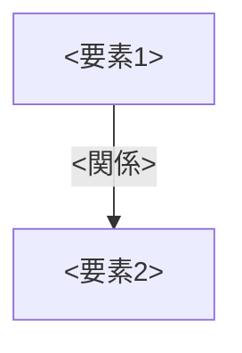

テンプレート説明
- 複数機能・複数レイヤーを横断する構成方針を扱う場合に使用する。個別メソッドの処理内容は処理記述書側に記載し、ここには重複させない。
- 使用しない見出し・説明・表のサンプル行は削除する。

---

# <方針名>

- **工程**: 設計工程
- **作成者**: ○○（AIであればモデル名を記載）
- **作成日**: yyyy-mm-dd
- **最終更新日**: yyyy-mm-dd

---

## ○概要

### 目的
- 何のためにこの構成方針を定めるかを簡潔に記載する。
- 1文ごとに改行し、最大3文まで。

### 対象範囲
- どの機能・ファイル・ディレクトリが対象かを記載する。

---

## ○構成

- 構成要素（レイヤー・モジュール等）を表で一覧化する。

| 要素 | 役割 | 対応ファイル・ディレクトリ |
|---|---|---|
|  |  |  |

- 構成要素間の関係は図（mermaidのflowchart/graph記法）で示す。要素・矢印はいずれも役割が分かる短いラベルを付ける。
- 禁止される関係（層を飛び越える呼び出し等）がある場合は、破線・別色などで区別し、ラベルに「禁止」等と明記する。

---

## ○ルール

- 遵守すべきルールを箇条書きまたは表で記載する。
- 例外を認める場合は条件を明記する。例外を認めない場合はその旨を明記する。
- ルール本文の一次情報（`implementation`スキル（[implementation/SKILL.md](../../../implementation/SKILL.md)）等）がある場合は原文を引用し、出典を明記する。

---

## ○対応状況

- 対象範囲に含まれる機能・箇所を区分ごとに分類する場合は、区分の意味を先に一覧化する。

| 区分 | 意味 |
|---|---|
|  |  |

- 対象範囲に含まれる機能・箇所ごとに、区分・対応内容を表で記載する。

| 区分 | 対象 | 備考 |
|---|---|---|
|  |  |  |

---

## ○根拠・関連資料

- この方針の判断理由・経緯を記載した判断根拠書等がある場合は参照先を記載する。
- 実装時に参照すべきルール文書がある場合は参照先を記載する。
- 対応時の実測値・対応順序等の詳細資料がある場合は参照先を記載する。
