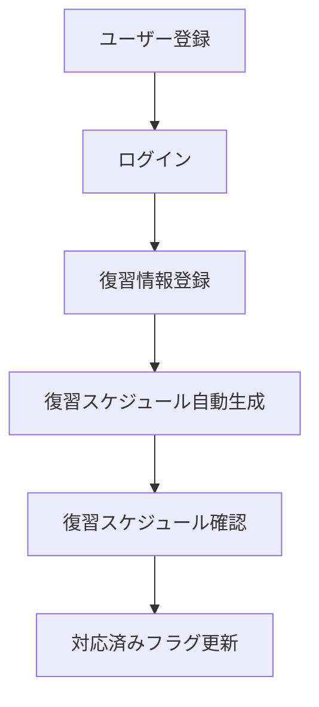

# 業務要件

- **工程**: 要件定義工程
- **作成者**: 利用者
- **作成日**: 2026-09-11
- **最終更新日**: 2026-09-11

---

## 対象業務

| 業務 | 内容 | 担当者 |
|---|---|---|
| ユーザー管理 | ユーザーの登録・ログイン・更新・削除 | 利用者 |
| 復習情報管理 | 復習項目の登録・取得・更新・削除 | 利用者 |
| 復習スケジュール管理 | 復習情報と連動した復習スケジュールの自動生成・更新・削除 | システム自動処理 |

---

## 業務の流れ

---

## 利用状況
- 規模：同じLAN内の複数人（家族・自宅内等）、同時利用者数は最大10人
- 時期・時間：利用者が任意のタイミングで使用する。オンデマンド起動のため、常時稼働は前提としない
- 場所：サーバー（Dockerコンテナ）を稼働させるローカルPCと同じLAN内からのみ利用可能。クライアントはAPIクライアント（ブラウザ・アプリ等）

---

## 成功基準
- 復習スケジュールの遵守率（利用者が期日通りに復習を完了しているか）

---

## 対象範囲

| 区分 | 内容 |
|---|---|
| 対象 | ユーザー管理・復習情報管理・復習スケジュール管理・フロントエンド画面（React） |
| 対象外 | 学習コンテンツの提供・通知機能 |

---

## 前提・制約
- 個人による開発・運用であり、運用・保守の担当は1人
- インターネットへは公開せず、ローカルPC上での稼働に限定する
