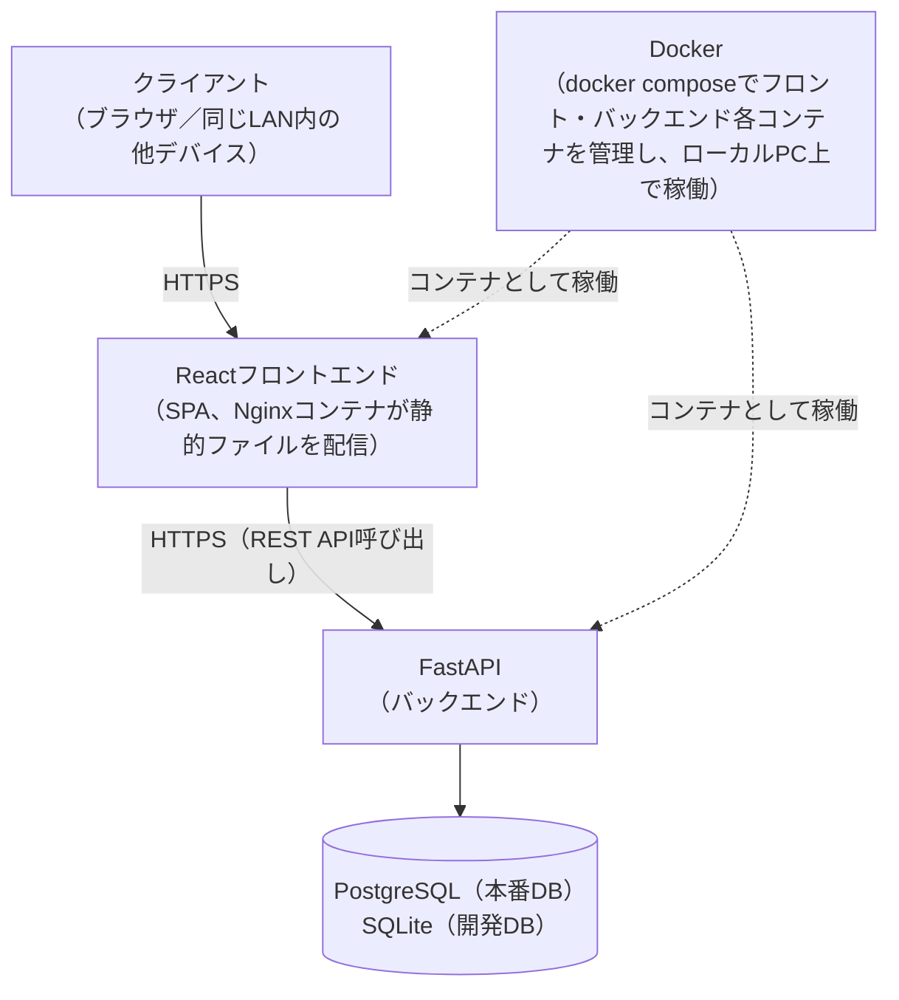

# 概要

- **工程**: 要件定義工程
- **作成者**: 利用者
- **作成日**: 2026-09-11
- **最終更新日**: 2026-09-11

---

## 目的
- FastAPI・Dockerを含めたシステム開発技術の学習
- エビングハウスの忘却曲線に基づいた効率的な復習タイミングのリスト化・管理を、実用的なシステムとして利用者に提供する

## 背景・課題
- 勉強をしても成果が上がっていると実感できない
- 時間が限られており、隙間時間を有効活用したい
- 復習タイミングの管理が面倒で継続しにくい
- 学習後に復習を行わなくなってしまう

## 想定利用者
- 一般利用者：同じLAN内の複数人（家族・自宅内等）。復習情報を登録し、復習スケジュールを確認する
- 管理者：シード管理者。全ユーザーの情報を管理する

## システム構成

## 用語

| 用語 | 説明 |
|---|---|
| 復習情報 | ユーザーが登録する学習内容（復習項目・学習日・復習スケジュールを含む） |
| 復習スケジュール | エビングハウスの忘却曲線に基づき自動生成される5回分の復習日 |
| 対応済みフラグ | 各復習回が完了したかどうかを示すフラグ |
| エビングハウスの忘却曲線 | 時間経過とともに記憶が薄れる曲線。復習タイミングの根拠となる理論 |
| JWT | JSON Web Token。ログイン認証に使用するトークン形式 |
| オンデマンド起動 | 利用時のみローカルPC上でDockerコンテナを起動する運用方式 |
